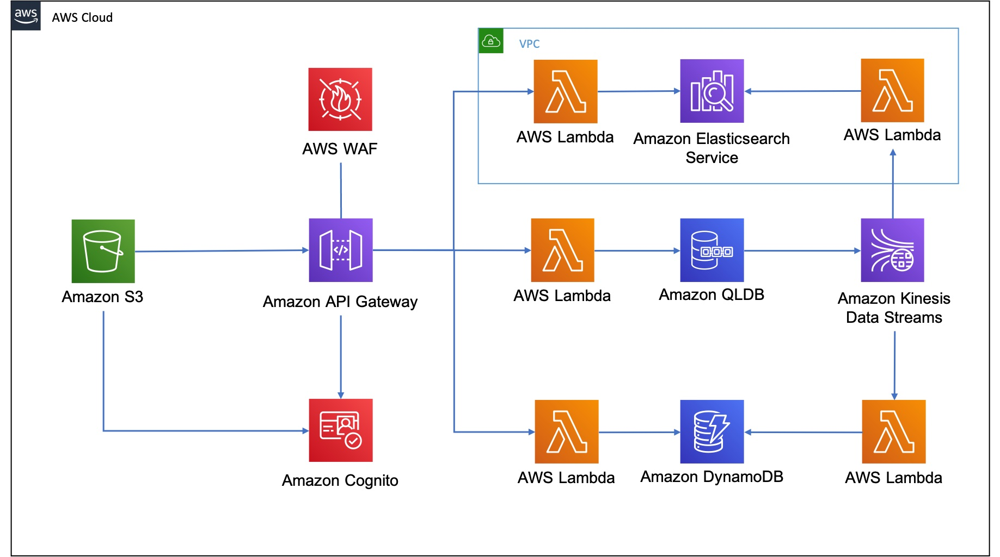

## Background

The `QLDB Demo` has been set up to allow to people to try out a working end to end demo application that utilises QLDB at its heart. The demo is based on the concept of a fictional `Bicycle Licence`. This is a licence that is held by an individual which allows them to ride a bicycle. There is the concept of penalty points which can be added or removed, but which exist as part of the licence.

QLDB maintains an immutable and cryptographically verifiable audit trail of all changes made to the licence. This brings the advantages of an event sourced application, and all changes have an event associated with them:

* `BicycleLicenceCreated`
* `PenaltyPointsAdded`
* `PenaltyPointsRemoved`
* `ContactAddressUpdated`
* `LicenceDeleted`

The system of record resides in QLDB, which acts as the source of truth. All changes are also streamed out in near real-time to other downstream purpose built database engines, showing the value of `QLDB Streams`. In terms of the demo, this means you can search for the licence in `Elasticsearch` or view all licences you have created from `DynamoDB`.

## Security

The demo itself requires a user to create an account which includes a valid email address they have access too. This is needed to receive a verification code to complete the signup process using `Amazon Cognito`.

Note that no access is provided to data such as the email address stored in the Cognito User Pool, and the data may be deleted at any point as new features are rolled out to the demo.

Access to the backend REST APIs is controlled using `Amazon Cognito` user pools as an authorizer. The web application makes an API call including the Identity Token of the signed-in user. The backend APIs are protected by `API Gateway` which validates the claimed identity against the one from the user pool.

The authenticated identity from the Cognito User Pool is retrieved from the claims in the `requestContext.authorizer.claims` section of the `event` passed into the `Lambda` function. This is stored as part of the document in QLDB and streamed out. This is used to ensure that you can only view records in `Elasticsearch` or `DynamoDB` that you created yourself.

## Architecture

The architecture that gets deployed for the QLDB Demo application is shown below:



The Web UI is a `React` application built using the `Amplify` framework that gets deployed to `S3` (and `CloudFront`). It uses the pre-built UI components to create the entire authentication flow. This utilises the `withAuthenticator` as a higher-order Component (`HoC`) that wraps `AmplifyAuthenticator`. It also ensures that a user has to be authenticated. When the user creates an account, they will automatically be setup in the `Cognito User Pool`

The `API Gateway` component acts as the gatekeeper to all backend services. By default API Gateway implements an account level rate limit. This is further broken down by setting specific request throttling limits on each API in the stage. A WAF ACL is also configured with a rate-based rule by IP address.

The `API Gateway` uses an `Authorizer` to control access to the API using the `Cognito User Pool`. This means that a user must be signed in to the web application to make a request. The React app gets the users current session using `Auth.currentSession()` which returns a `CognitoUserSession` object which contains a JSON Web Token (JWT) `accessToken`, `idToken`, and `refreshToken`. It then calls `getIdToken().getJwtToken()` on the `CognitoUserSession` object, and sets this as the bearer token in the `Authorization` header of the HTTP request.

The user pool access token contains claims about the authenticated user. The purpose of the token is to authorise API operations in the context of the user in the user pool e.g. is this person authorised to call this operation. 

The ID token is a JSON Web Token which consists of three sections:

1. Header
2. Payload
3. Signature

The header contains the key id (kid) indicating which key was used, and the algorithm, to secure the JWT token. An example of the header is shown below:

```json
{
  "kid": "InmBs3RFeOvQByvu3eeup3CXFhK1ue3yxRJFkrC+FJk=",
  "alg": "RS256"
}
```

The payload contains claims about the authenticated user. An example is shown below:

```json
{
  "sub": "3accc363-3b47-4c30-8c76-d63c9d919e64",
  "email_verified": true,
  "iss": "https://cognito-idp.eu-west-1.amazonaws.com/{userPoolId}",
  "phone_number_verified": false,
  "cognito:username": "name",
  "aud": "6s7aqshim3e29bg4slrs7bp0ud",
  "event_id": "394c766b-44b9-4355-807b-e455dfb1715e",
  "token_use": "id",
  "auth_time": 1612980614,
  "phone_number": "+4401234567890",
  "exp": 1614641916,
  "iat": 1614638316,
  "email": "example@email.com"
}
```

* The `sub` claim is a UUID for the authenticated user as the username may not be unique.
* The `iss` claim specifies the individual user pool that is used.
* The `aud` claim contains the `App Client ID` of the Cognito application client being used.
* The `token_use` claim describes the intended purpose of this token. Its value is always `id` in the case of the ID token.
* The `auth_time` claim contains the time when the authentication occurred

The signature of the ID token is calculated based on the header and payload of the JWT token. This signature is verified by API Gateway before accepting the token. This is carried out by searching for the key with the key ID that matches the `kid`, then using libraries to decode the token and verify the signature. In addition, there are checks to ensure that the token is not expired, and that the `aud` specified in the payload matches the app client ID created in the `Cognito User Pool`.

`API Gateway` use proxy integration to route authorized requests to the relevant `Lambda` function. A separate `Lambda` function is used to ensure adoption of the least privilege principle. A set of `Lambda` functions are used to update `QLDB` as the source of truth for Bicycle Licence information.

At the same time as `QLDB` is updated, `QLDB Streams` is configured to publish all changes onto a `Kinesis Data Stream`. `Lambda` functions are used to subscribe to the data stream, and then to update either `DynamoDB` or `Elasticsearch` with the relevant information, to show how streams processing provides an event driven architecture.