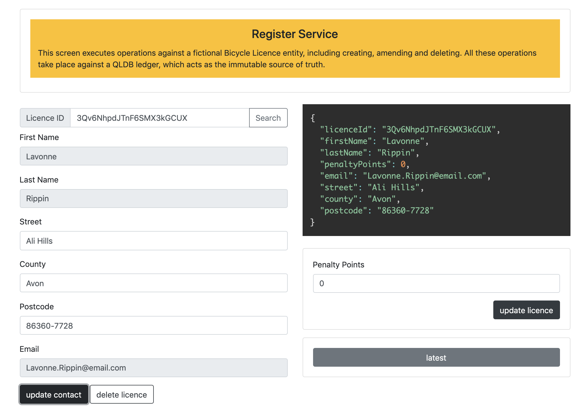

## Register

The `Register` screen allows you to register, amend and delete a fictional Bicycle Licence.

Fields are automatically populated initially with fake data, but they can also be overridden. Clicking the `Create` button will create a new record in QLDB for the particular licence including a `BicycleLicenceCreated` event. The data returned by QLDB is shown in the top right of the screen.

On the `Register` screen you are  able to amend the details of the Bicycle Licence. This includes adding or removing penalty points, as well as updating contact details. Depending on the type of change being made, the following events may be created:

* `PenaltyPointsAdded`
* `PenaltyPointsRemoved`
* `ContactAddressUpdated`

It is also possible on this page to delete a specific Bicycle Licence record, which results in a `LicenceDeleted` event.

Clicking on the `latest` button will take you to the `History` screen, to show the state of the full state of the licence record.
