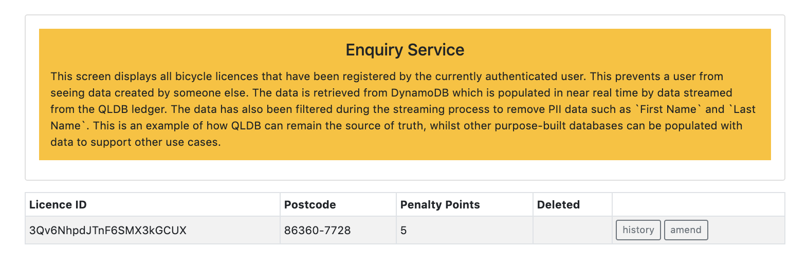

## Enquiry

The `Enquiry` screen displays details about all of the Bicycle Licence records that you have created, including those that have subsequently been deleted. This information is retrieved from `Amazon DynamoDB` that is streamed in near real-time from QLDB.

The record in `DynamoDB` does not contain any PII data such as first name, last name or address. This is to highlight another great use of `QLDB Streams` - filtering out data that is not wanted or desired in a downstream service.
