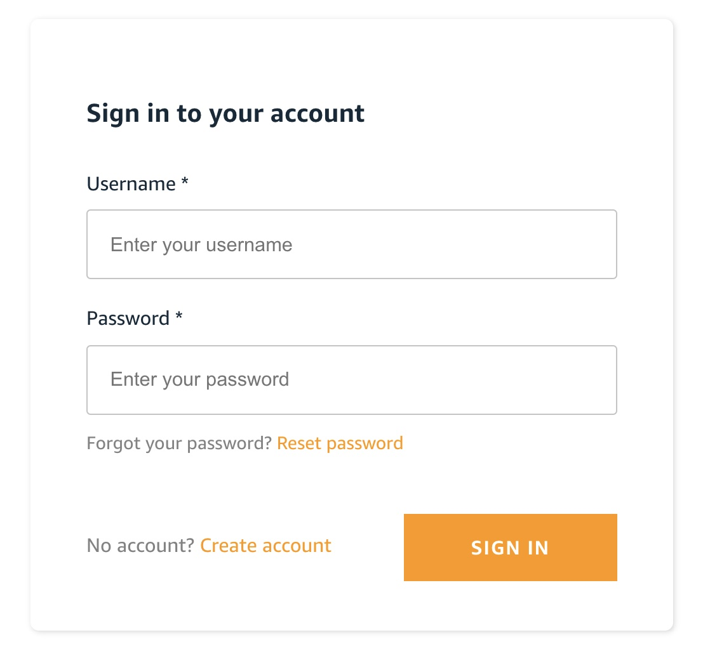
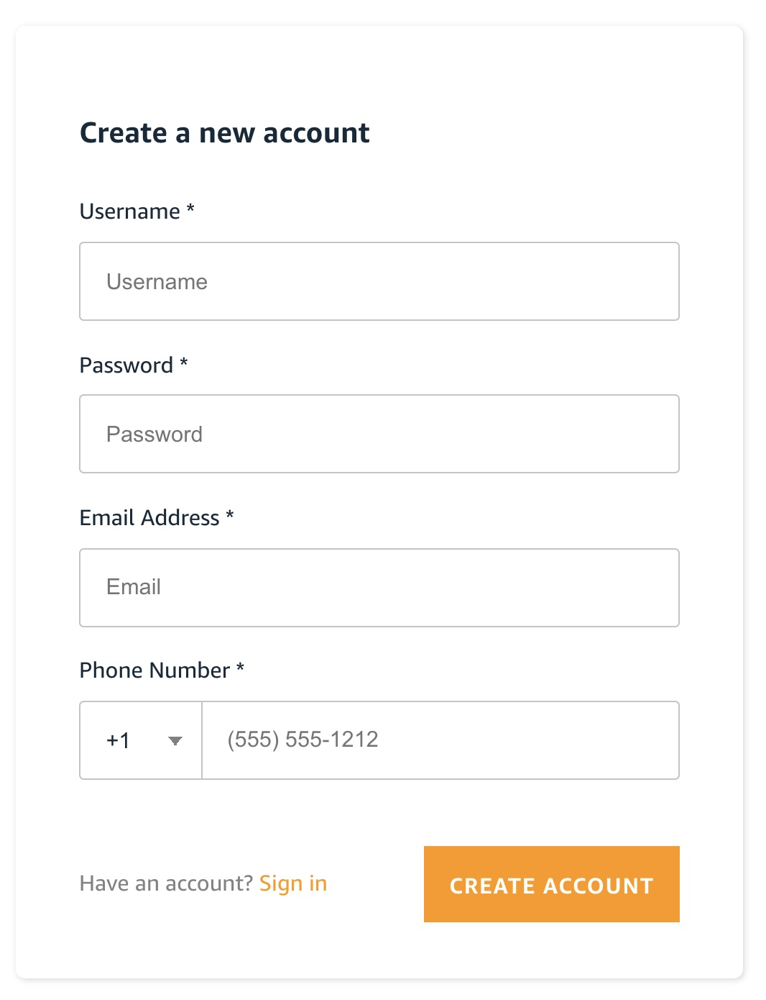
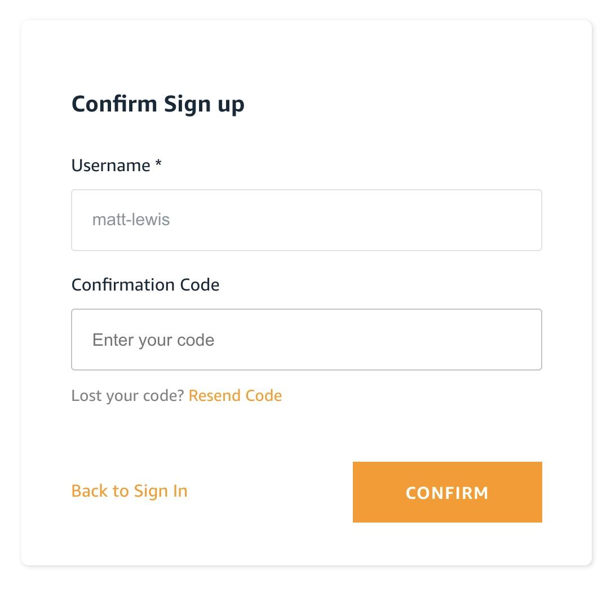
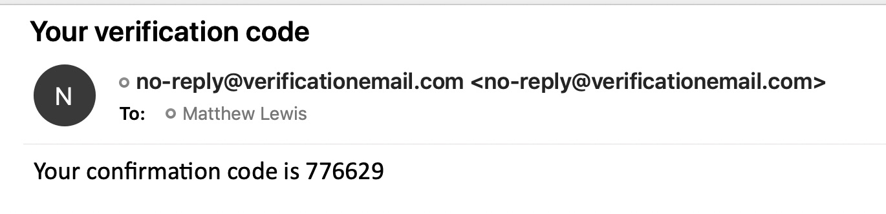
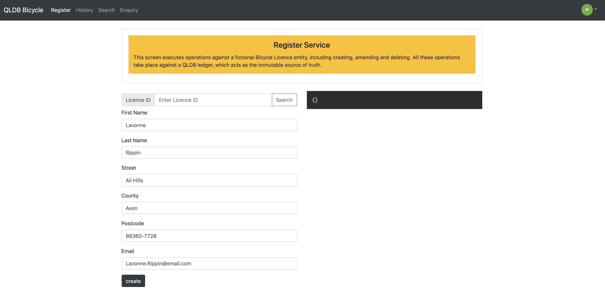

To get started, click one of the links to the [QLDB Demo](https://qldbdemo.com). This will take you to a hosted page where you can sign in if you already have credentials, else create an account:

{ width="50%" }

When you create an account, you must specify a `username`, `password`, `email address` and `phone number`. The `email address` must be a valid email address that you have access too. No use is made of phone number so any values can be entered here.

{ width="50%" }

After you click on the `Create Account` button, you will be presented with a screen to confirm the sign-up process. Here you will need to enter a verification code:

{ width="50%" }

The verification will automatically be sent to the email address you used to register with:

{ width="70%" }

After you enter this code and click confirm, you will be presented with the main landing page of the `QLDB Demo`, which allows you to create, update and delete a Bicycle Licence:

