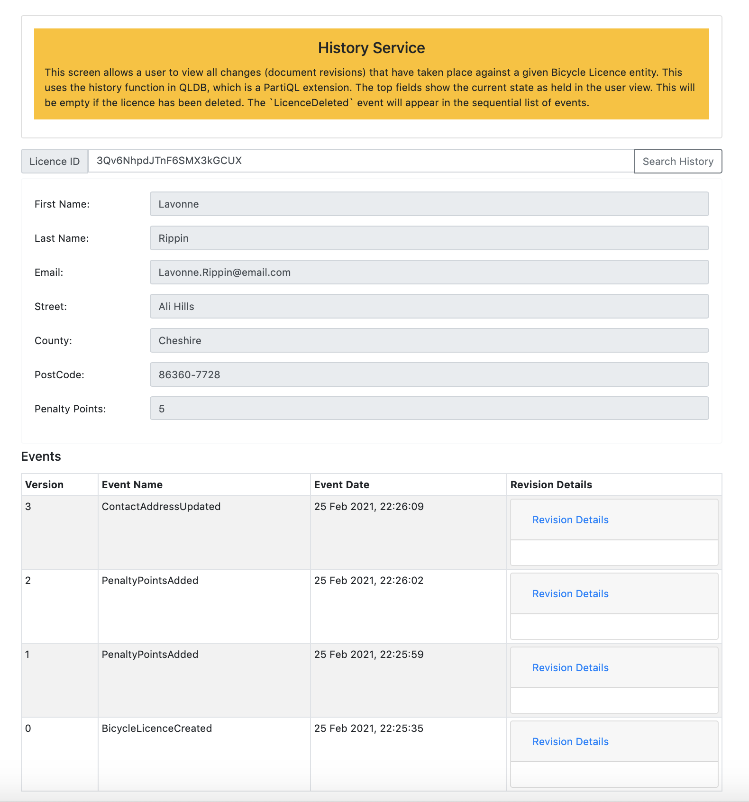

## History

The `History` screen allows you to view not only the current state but also the full revision history of a Bicycle Licence record retrieved using the history function.

The current state of a record is shown in the fields at the top of the screen. If a record has been deleted then these fields will be blank.

At the bottom of the screen is a summary of all the revisions in chronological order that have ever taken place against the specific Bicycle Licence record. You can click on `Revision Details` to view the main attributes in that document revision. Note the full document revision is available, but not all attributes are shown.
