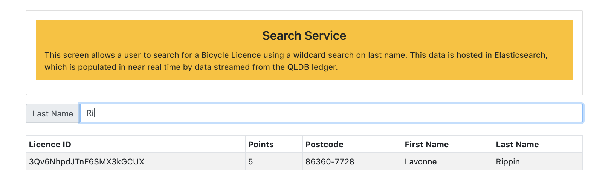

## Search

The `Search` screen allows you to search for Bicycle Licence records held in `Amazon Elasticsearch` that have been streamed in near-time by QLDB.

This is a great option where there are specific search requirements met by a service like `Elasticsearch`. In this case, the search includes both an exact match on the unique ID of the signed in user (to ensure they can only see records they created), but also includes a wildcard search filter, so that you only need to enter the first couple of characters of the lastname, and all matching records will be returned.

The other thing to notice is how quickly a record appears in `Elasticsearch` after it has been created.
