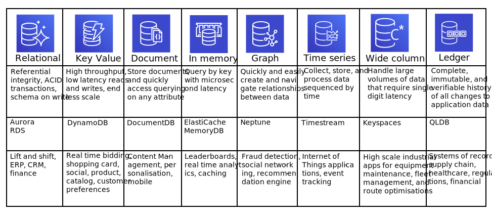

## Purpose Built Databases

Werner Vogels wrote a blog post that ['a one size fits all database doesn't fit anyone'](https://www.allthingsdistributed.com/2018/06/purpose-built-databases-in-aws.html). One of the reasons AWS built DynamoDB was that the traditional relational database being used for Amazon.com couldn't meet the required availability, scalability or performance needs. They found that 70% of operations were key-value lookups, which used a primary key and returned a single row. This type of access pattern was better suited to a different type of database.

Today, QLDB forms part of a family of purpose-built databases offered by AWS:

In his book 'Designing Data-Intensive Applications', Martin Kleppman noted many forces driving the adoption of a new breed of databases, including:

* A need for greater scalability than relational databases can easily achieve, including very large datasets or very high write throughput
* A widespread preference for free and open source software over commercial database products
* Specialized query operations that are not well supported by the relational model
* Frustration with the restrictiveness of relational schemas, and a desire for a more dynamic and expressive data model

All of this means that the best choice of technology for one use, may well be different from the best choice for another. 

QLDB is firmly positioned to support systems of record, which can benefit from the immutability and completeness of the record, and the cryptographic verification that can be applied. It's new streaming feature enables changes to the data captured in the journal to be streamed out, which can be linked in to other purpose built databases to get the best of all worlds.