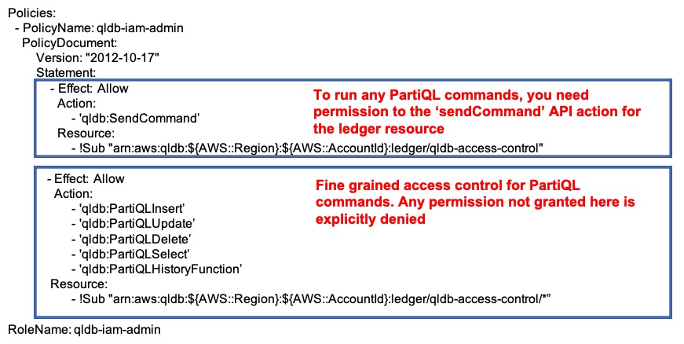

When QLDB was first launched, it provided a set of actions for interacting with the control plane API to manage ledgers [(see here)](https://docs.aws.amazon.com/qldb/latest/developerguide/API_Operations.html), but only a single action for interacting with a ledger over the data plane API. This meant any user or role required the `qldb:sendCommand` permission for issuing a `PartiQL` command against a ledger. With this IAM permission, you were able to execute all `PartiQL` commands from simple lookups, to mutating current state with updates and deletes, and querying all revision history.

This all changed on July 1st 2021 with the QLDB support for IAM-based access policy for PartiQL queries and ledger tables [(see here)](https://aws.amazon.com/about-aws/whats-new/2021/06/amazon-qldb-supports-iam-based-access-policy-for-partiql-queries-and-ledger-tables/). This release from the Amazon QLDB team provides support for fine-grained IAM permissions when interacting with a ledger, which helps enforce least-privilege.

A demo application with code and setup instructions can be found in the [QLDB access control demo repo](https://github.com/AWS-South-Wales-User-Group/qldb-access-control-demo)

Before this release, the only permissions mode supported was `ALLOW_ALL`, which allowed any user with this permission to execute any PartiQL command. This is now marked as legacy and should not be used. Instead, you should use the `STANDARD` permissions mode for ledger resources. This enables access control with fine grained permissions for ledgers, tables and PartiQL commands.

In order to execute any PartiQL command, permission must be given to the `sendCommand` API action for the ledger resource. Explicit permission to PartiQL commands can then be given, taking into account that requests to run all PartiQL commands are denied unless explicitly allowed here. An example of a policy document is shown below:



In addition, there is also the ability to define table tags when creating a table:

```
CREATE TABLE Vehicle WITH (aws_tags = `{'environment': 'production'}`)
```

You can then restrict access to tables, and use conditions to further control access to tables based on these tags.

```
{
    "Version": "2012-10-17",
    "Statement": [
        {
            "Action": [
                "qldb:SendCommand"
            ],
            "Resource": [
                "arn:aws:qldb:${AWS::Region}:${AWS::AccountId}:ledger/qldb-access-control"
            ],
            "Effect": "Allow"
        },
        {
            "Action": [
                "qldb:PartiQLSelect"
            ],
            "Resource": [
                "arn:aws:qldb:${AWS::Region}:${AWS::AccountId}:ledger/qldb-access-control/table/59Nar66iNtpDBlKtfhyxJF"
            ],
            "Effect": "Allow",
            "Condition": {
                "StringEquals": { "aws:ResourceTag/environment": "development" }
            }
        }
    ]
}
```

You need to reference the table in the policy via the unique table ID. This is returned the first time a table is created. You can also retrieve this id and other metadata by querying the system catalog table `information_schema.user_tables`.

```
SELECT tableId FROM information_schema.user_tables
WHERE name = 'Vehicle'
```

Where there is no requirement to create custom policies, AWS provide a number of managed policies to allow you to get started quickly, which are:

* AmazonQLDBReadOnly
* AmazonQLDBFullAccess
* AmazonQLDBConsoleFullAccess


To read more about the available QLDB PartiQL commands and required permissions [(see here)](https://docs.aws.amazon.com/qldb/latest/developerguide/getting-started-standard-mode.html)